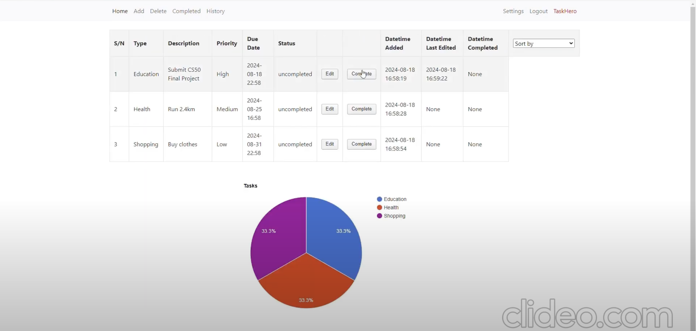

# TaskHero 🦸


[](https://opensource.org/licenses/MIT)

TaskHero is a powerful and intuitive task management web application built with Python and Flask. It helps users organize their daily chores, work assignments, and personal goals in a clean, efficient, and user-friendly interface. Stay on top of your responsibilities and become the hero of your own tasks!

## Table of Contents
- [ℹ️ About The Project](#about-the-project)
- [🎥 Project Demo](#project-demo)
- [✨ Key Features](#key-features)
- [🚀 Getting Started](#getting-started)
  - [🛠 Prerequisites](#prerequisites)
  - [⚙️ Installation & Setup](#installation--setup)
- [📂 File Structure](#file-structure)
- [📖 Usage Guide](#usage-guide)
- [📜 License](#license)
- [🙏 Acknowledgements](#acknowledgements)

## ℹ️ About The Project

TaskHero is designed to be a one-stop solution for personal task management. Built using the Flask web framework and a SQLite database, it provides a robust set of features for creating, viewing, updating, and deleting tasks. The application emphasizes security with password hashing and user-specific data handling, ensuring that each user's task list is private and secure.

**Core Technologies:**
*   **Backend:** Python, Flask
*   **Database:** SQLite (interfaced via the CS50 SQL Library)
*   **Frontend:** HTML, CSS, JavScript, Bootstrap
*   **Authentication:** Werkzeug for password hashing, Flask-Session for session management

## 🎥 Project Demo

Watch a full walkthrough of the TaskHero application, from user registration to task management and account settings.

[](https://youtu.be/6h2Y0zDBpOo)

## ✨ Key Features

✅ **Secure User Authentication:**
*   User registration with strong password requirements (12+ characters, uppercase, digit, special character).
*   Secure login and logout functionality.
*   Password hashing to protect user credentials.

✅ **Comprehensive Task Management (CRUD):**
*   **Create:** Add new tasks with a description, type (e.g., Work, Personal), priority (Low, Medium, High), and a specific due date and time.
*   **Read:** View tasks on separate dashboards for 'Uncompleted', 'Completed', and a combined 'History' view.
*   **Update:**
    *   Edit any detail of an existing task.
    *   Mark tasks as complete or un-complete with a single click.
*   **Delete:** Remove one or more tasks permanently.

✅ **Advanced Sorting & Filtering:**
*   Sort tasks on each page by Priority, Due Date, Date Added, Date Edited, or Date Completed.
*   Custom sorting logic for Priority (High -> Medium -> Low).

✅ **User Account Management:**
*   Dedicated settings page to manage your account.
*   Ability to change your username (requires password verification).
*   Ability to change your password (requires current password verification).

✅ **User-Friendly Interface:**
*   Clean and intuitive design.
*   Custom apology/error pages for a better user experience.
*   Persistent sessions ensure you stay logged in until you choose to log out.

## 🚀 Getting Started

Follow these instructions to get a local copy of TaskHero up and running on your machine.

### 🛠 Prerequisites

*   Python 3.7+
*   pip (Python package installer)

### ⚙️ Installation & Setup

1.  **Clone the repository:**
    ```bash
    git clone https://github.com/raedeon/taskhero.git
    cd taskhero
    ```

2.  **Create and activate a virtual environment (recommended):**
    ```bash
    # For macOS/Linux
    python3 -m venv venv
    source venv/bin/activate

    # For Windows
    py -m venv venv
    venv\Scripts\activate
    ```

3.  **Install the required packages:**
    ```bashsqli
    pip install -r requirements.txt
    ```

4.  **Run the Flask application:**
    ```bash
    flask run
    ```
    The application will be available at `http://127.0.0.1:5000`.

## 📂 File Structure

```
.
├── app.py                # Main Flask application logic, routes, and database interactions
├── helpers.py            # Helper functions (apology page, password check)
├── requirements.txt      # Project dependencies
├── taskhero.db           # SQLite database file
├── static/               # Folder for CSS, JavaScript, and images
│   └── styles.css
│   └── error.jpg
│   └── piechart.js
└── templates/            # Folder for all HTML templates
    ├── add.html
    ├── apology.html
    ├── changepassword.html
    ├── changeusername.html
    ├── completed.html
    ├── delete.html
    ├── edit.html
    ├── history.html
    ├── index.html
    ├── layout.html
    ├── login.html
    ├── register.html
    └── settings.html
```

## 📖 Usage Guide

1.  **Register:** Navigate to the `/register` page to create a new account. You'll need to provide a unique username and a strong password.
2.  **Login:** Once registered, log in with your credentials. You will be redirected to the main dashboard.
3.  **Add a Task:** Go to the "Add Task" page. Fill in the details: type, description, priority, and due date. The task will now appear on your main dashboard.
4.  **Manage Tasks:**
    *   On the main dashboard (`/`), you'll see all your **uncompleted** tasks.
    *   Click the "Complete" button to move a task to the "Completed" page.
    *   Click the "Edit" button to modify a task's details.
5.  **View Completed Tasks:** Navigate to the "Completed" page to see all tasks you have finished. From here, you can mark a task as "Uncomplete" to move it back to your main dashboard.
6.  **View History:** The "History" page shows a complete log of all your tasks, both completed and uncompleted.
7.  **Delete Tasks:** Go to the "Delete" page, select the tasks you want to remove using the checkboxes, and click "Delete".
8.  **Settings:** Visit the "Settings" page to change your username or password.

## 📜 License

This project is distributed under the MIT License. See `LICENSE` for more information.

## 🙏 Acknowledgements
*   [CS50 Library](https://cs50.readthedocs.io/libraries/cs50/python/) for its simple and effective SQL database wrapper.
*   [Flask Framework](https://flask.palletsprojects.com/)
*   [Werkzeug](https://werkzeug.palletsprojects.com/)
